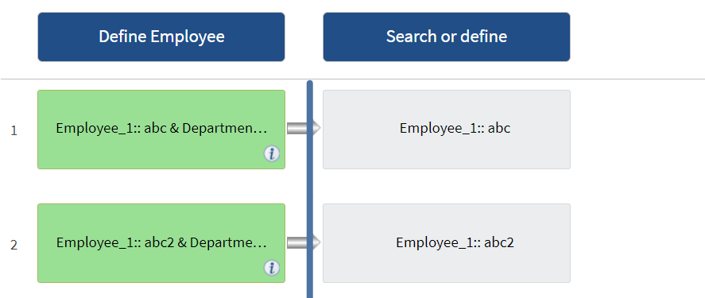

= Como a repetição de linha funciona
:allow-uri-read: 
:icons: font
:imagesdir: ../media/

[role="lead"]
Um fluxo de trabalho contém comandos e detalhes de comando organizados em linhas. Você pode especificar os comandos em uma linha a serem repetidos para um número fixo de iterações ou número dinâmico de iterações com base nos resultados dos critérios de pesquisa.

Os detalhes do comando em uma linha podem ser especificados para repetir um determinado número de vezes ou quando o fluxo de trabalho é projetado. O fluxo de trabalho também pode ser projetado de modo que o número de vezes que a linha deve repetir pode ser especificado quando o fluxo de trabalho é executado ou programado para uma execução. Você pode especificar critérios de pesquisa para um objeto e os comandos em uma linha podem ser definidos para repetir quantas vezes os objetos forem retornados pelos critérios de pesquisa. As linhas também podem ser definidas para repetir quando determinadas condições forem atendidas.

== Variáveis de repetição de linhas

Você pode especificar variáveis na lista de variáveis que podem ser manipuladas durante as iterações de linha. Para as variáveis, você pode especificar um nome, um valor com o qual as variáveis são inicializadas e uma expressão MVFLEX Expression Language (MVEL) que é avaliada após cada iteração da repetição de linha.

A ilustração a seguir mostra as opções de repetição de linha e um exemplo de uma variável de repetição de linha:

image::../media/row_repetition_details.png[detalhes de repetição de linhas]

== Repetição de linhas com pontos de aprovação

Quando tiver especificado iterações de linhas repetidas para comandos e incluído pontos de aprovação, todas as iterações dos comandos antes de um ponto de aprovação são executadas. Depois de aprovar o ponto de aprovação, a execução de todas as iterações dos comandos sucessivos continua até o próximo ponto de aprovação.

A ilustração a seguir mostra como as iterações de linhas repetidas são executadas quando um ponto de aprovação é incluído em um fluxo de trabalho:

== Repita exemplos de linhas em fluxos de trabalho predefinidos

Você pode abrir os seguintes fluxos de trabalho predefinidos no Designer para entender como as linhas de repetição são usadas:

* Criar um volume de NFS Data ONTAP em cluster
* Crie o armazenamento de dados do VMware NFS no storage Data ONTAP em cluster
* Estabelecer peering de cluster
* Remover um volume Data ONTAP agrupado

